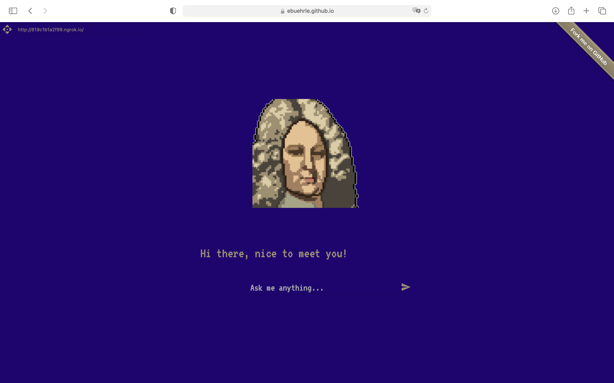

# William
> A GPT chatbot with Charles III William persona.

## Quick Start
Open the Colab notebook above and run it. Once the last cell starts executing, copy the public URL that shows up in the output

Go to [ebuehrle.github.io/william](https://ebuehrle.github.io/william), paste the URL into the field at the top left, and start chatting.

